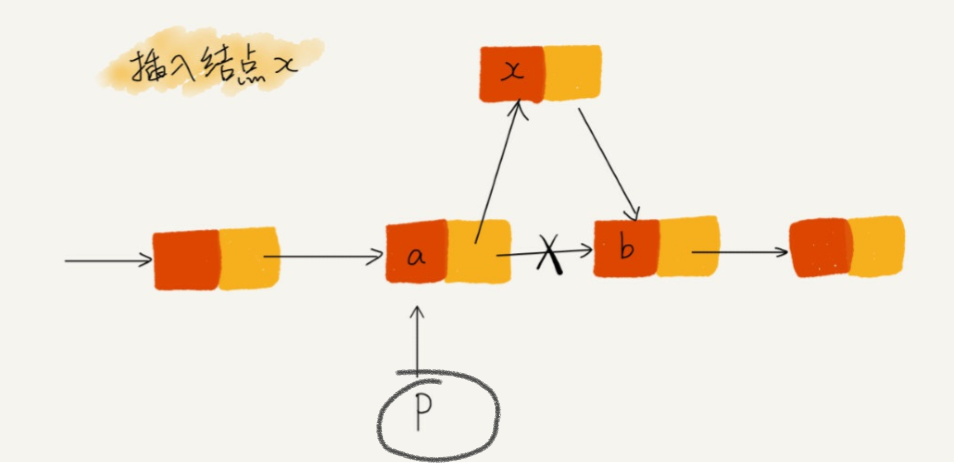

## 链表
链表不需要一块连续的存储空间，通过指针将一组零散的内存块串联在一起进行使用。

常见的链表结构有：
- 单链表
- 双向链表
- 循环链表

## 防止指针丢失

在单链表中，进行插入的时候经常出现一些错误。


希望在a和b之间插入一个新的节点x，假设当前指针p指向节点a。

下面的代码是错误的示范
```c
p->next = x;    //将p的next指针指向x结点
x->next = p->next;  //将x的结点的指针指向b结点
```
上面代码第一眼看起来，没有什么问题。但仔细的看起来，就发现代码出现了问题，`p->next`在完成一行代码的操作之后，已经不再指向b结点了，而是指向了x结点。在执行第2行代码的时候，意思就是将x赋值给`x->next`，也就是自己赋值在自己。也就是说，在进行上面的代码之后，整个单向链表以及一分为二，从b结点之后的结点都是没有办法访问的啦。

正确的操作先将结点x的next指针指向结点b，然后把结点a的next指针指向结点x。这样不会出现指针的丢失导致内存泄漏。正确的代码就是将上面的代码换一下行就可以啦。

在插入一行


## 多练习

- 单链表反转
- 链表中环的检测
- 两个有序的链表合并
- 删除链表倒数第n个结点
- 求链表的中间结点